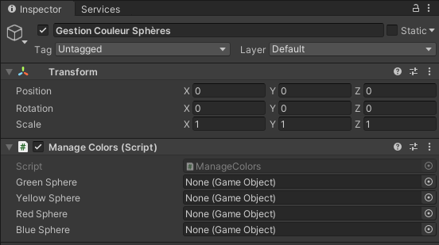

# 2020-PO-Guitare-HelloWorld

## Sommaire

* [Environnement de développement](https://github.com/divtec-cejef/2020-PO-Guitare-HelloWorld#environnement-de-d%C3%A9veloppement)
* [Procédure d'installation](https://github.com/divtec-cejef/2020-PO-Guitare-HelloWorld#proc%C3%A9dure-dinstallation)
  * [Procédure d'installation Unity](https://github.com/divtec-cejef/2020-PO-Guitare-HelloWorld#proc%C3%A9dure-dinstallation-unity)
  * [Procédure d'installation JoyToKey](https://github.com/divtec-cejef/2020-PO-Guitare-HelloWorld#proc%C3%A9dure-dinstallation-de-joytokey)
* [Création d'un projet Unity](https://github.com/divtec-cejef/2020-PO-Guitare-HelloWorld#cr%C3%A9ation-dun-projet-unity)
* [Projet](https://github.com/divtec-cejef/2020-PO-Guitare-HelloWorld#projet)
* [Création des objets](https://github.com/divtec-cejef/2020-PO-Guitare-HelloWorld#cr%C3%A9ation-des-objets)
  * [Création des sphères](https://github.com/divtec-cejef/2020-PO-Guitare-HelloWorld#cr%C3%A9ation-des-sph%C3%A8res)
  * [Modifier la position des sphères](https://github.com/divtec-cejef/2020-PO-Guitare-HelloWorld#modifier-la-position-des-sph%C3%A8res)
  * [Création d'un objet vide pour la gestion des couleurs](https://github.com/divtec-cejef/2020-PO-Guitare-HelloWorld#cr%C3%A9ation-dun-objet-vide-pour-la-gestion-des-couleurs)
* [Création d'un dossier pour les scripts](https://github.com/divtec-cejef/2020-PO-Guitare-HelloWorld#cr%C3%A9ation-dun-dossier-pour-les-scripts)
* [Scripts](https://github.com/divtec-cejef/2020-PO-Guitare-HelloWorld#scripts)
  * [Créer un script](https://github.com/divtec-cejef/2020-PO-Guitare-HelloWorld#cr%C3%A9er-un-script)
  * [Programmation](https://github.com/divtec-cejef/2020-PO-Guitare-HelloWorld#programmation)
  * [Mettre le script sur GameObject](https://github.com/divtec-cejef/2020-PO-Guitare-HelloWorld#mettre-le-script-sur-gameobject)
* [Conclusion](https://github.com/divtec-cejef/2020-PO-Guitare-HelloWorld#conclusion)

Projet Unity reprenant la technologie des guitares du projet Epic Wheel Hero.
Le but sera de créer 4 sphères qui prendront chacune l'une des couleurs correspondant aux touches appuyées sur la guitare !

Sources:

* https://unity.com/

## Environnement de développement

Installer les outils suivants :

* Unity HUB: https://unity3d.com/fr/get-unity/download
* Unity version 2019.3.15: https://unity3d.com/fr/get-unity/download/archive
* JoyToKey (joytokey.net) : https://joytokey.net/en/download

## Procédure d'installation

### Procédure d'installation Unity

1. Installer [Unity HUB](https://unity3d.com/fr/get-unity/download)

2. Aller chercher dans les [archives Unity](https://unity3d.com/fr/get-unity/download/archive) les versions 2019.x.

   

3. Télécharger et installer la version 2019.3.15 en cliquant sur Unity HUB.

   

4. Lors de la sélection des modules supplémentaire, ne cocher que Visual studio 2019.

5. Attendre que l'installation se fasse.

### Procédure d'installation de JoyToKey

1. Télécharger [JoyToKey](https://joytokey.net/en/download) .

2. Installer le logiciel.

3. Brancher l'adaptateur USB de la guitare au PC.

4. Attendre que les drivers s'installent.

5. Exécuter JoyToKey

6. Ouvrir l’explorateur de fichiers et se déplacer vers le répertoire suivant :
   C:\Users\’nom d’utilisateur’\Documents\JoyToKey

7. Mettre le fichier [EpicWheelHero.cfg](https://github.com/divtec-cejef/2020-PO-Guitare-HelloWorld/blob/main/Fichier%20supp/EpicWheelHero.cfg) dans le dossier JoyToKey. Il permet d'importer une configuration déjà faite.

8. Fermer JoyToKey, clic droit sur l’icône dans la barre des tâches puis `Terminate JoyToKey`.

9. Lancer de nouveau JoyToKey, le fichier de configuration à été pris en compte.

10. Appuyer sur le bouton qui « tourne en rond » pour faire la connexion

    

11. Appuyez sur une touche avec la guitare. La case « Joystick 1 » devrait se colorier.

12. La guitare est désormais connectée.

## Création d'un projet Unity

1. Exécuter Unity HUB.

2. Cliquer sur le bouton New.

   

3. Vérifier que la version de Unity est bien en 2019.3.15f1 (En haut à gauche de la fenêtre)

   

4. Donner un nom au projet (Guitare-HelloWorld) et choisir l'emplacement de celui-ci (Vous pouvez créer un dossier dans `C:\Users\admin\Documents` comme dans l'exemple).

# Projet

En ouvrant le projet, vous arriverez à cette fenêtre-là.


## Création des objets

Pour créer les 4 sphères, suivre la procédure suivante.

### Création des sphères

1. Cliquer sur GameObject en haut à gauche de la fenêtre et suivre le chemin.

   Gameobject -> 3D Object -> Sphere

   

2. Créer les 4 sphères pour le jeu

3. Vous obtiendrez la fenêtre suivante.

   

4. Vous pouvez renommer les 4 sphères en faisant *clic droit* sur chaque nom de sphère sur la fenêtre à gauche puis *Rename*.

   

5. Vous pouvez mettre les noms suivants pour chaque sphère:

   * Sphère verte
   * Sphère jaune
   * Sphère rouge
   * Sphère bleue

### Modifier la position des sphères

Comme les 4 sphères sont les unes sur les autres, il faut modifier un peu leur position.

Normalement, si vous cliquez sur les sphères dans la fenêtre de jeu ou sur les noms à gauche, une fenêtre appelée *Inspector* à droite apparait. Sinon, il faut cliquer sur les 3 points en haut à droite (sur l'image) et choisir *Add Tab* -> *Inspector*.


Dans la ligne *Position* dans le *Transform* tout en haut de l'*Inspector*, vous pouvez mettre toutes les sphères à 0 si elles ne le sont pas déjà:

* X : 0
* Y : 0
* Z : 0

Une fois ceci fait, vous pouvez mettre les valeurs suivantes en position X:

* Sphère verte : 3
* Sphère jaune : 1.5
* Sphère rouge : 0
* Sphère bleue: -1.5

Vous devriez obtenir ceci:


### Création d'un objet vide pour la gestion des couleurs

Pour créer un objet vide, suivre le chemin suivant :

*GameObject* puis *Create Empty*. 


Renommer le GameObject *Gestion Couleur Sphères*

Cet objet contiendra le script pour gérer les couleurs.

## Création d'un dossier pour les scripts

Faire clic droit sur le dossier *Assets* en bas à gauche de la fenêtre, aller sur *Create* et sélectionner *Folder*


Ensuite, renommer le dossier avec le nom *Scripts*

## Scripts

### Créer un script

Faire un clic droit sur le dossier *Scripts*, *Create* puis *C# Script*.

Une fois créé, nommez-le avec le nom *ManageColors*.

### Programmation

Ouvrir le fichier précédemment créé.

1. On va déclarer les variables requises au fonctionnement du projet. Les variables seront initialisées dans la fonction *Start()*

   Les GameObjects sont en public afin d'être visible sur l'interface graphique de Unity. Ils représentent les sphères qui ont été créé auparavant.

   Les booléens servent à vérifier si la touche de la guitare a déjà été pressé.

   Les variables Material servent à récupérer la couleur des différentes sphères

   ```c#
   public class ManageColors : MonoBehaviour
   {
       public GameObject greenSphere;
       public GameObject yellowSphere;
       public GameObject redSphere;
       public GameObject blueSphere;
   
       private bool isBallGreen;
       private bool isBallYellow;
       private bool isBallRed;
       private bool isBallBlue;
   
       private Material greenSphereMat;
       private Material yellowSphereMat;
       private Material redSphereMat;
       private Material blueSphereMat;
   
       // Start is called before the first frame update
       void Start()
   ```

   

2. L'initialisation des variables se fait dans la fonction *Start()*. (Cette fonction est juste appelé au démarrage de la scène)

   ```c#
    // Start is called before the first frame update
   void Start()
   {
       // Initialisation des booléens
       isBallGreen = false;
       isBallYellow = false;
       isBallRed = false;
       isBallBlue = false;
   
       // Initialisation des Materials pour la couleur des sphères
       greenSphereMat = greenSphere.GetComponent<Renderer>().material;
       yellowSphereMat = yellowSphere.GetComponent<Renderer>().material;
       redSphereMat = redSphere.GetComponent<Renderer>().material;
       blueSphereMat = blueSphere.GetComponent<Renderer>().material;
   
       // Initialisation de la couleur des sphères
       greenSphereMat.color = Color.white;
       yellowSphereMat.color = Color.white;
       redSphereMat.color = Color.white;
       blueSphereMat.color = Color.white;
   }
   ```

3. La fonction *Update()* est la partie principale du code. Elle contient le code qui va s'exécuter pour le changement de couleur.

   ```c#
   void Update()
   {
       // Vérifie la touche pressé
               switch (Input.inputString)
               {
                   case "r":
                       // Vérifie si la sphère verte est déjà colorée
                       if (isBallGreen)
                       {
                           greenSphereMat.color = Color.white;
                           isBallGreen = false;
                       }
                       // Sinon la colorie
                       else
                       {
                           greenSphereMat.color = Color.green;
                           isBallGreen = true;
                       } break;
   
                   case "q":
                       // Vérifie si la sphère jaune est déjà colorée
                       if (isBallYellow)
                       {
                           yellowSphereMat.color = Color.white;
                           isBallYellow = false;
                       }
                       // Sinon la colorie
                       else
                       {
                           yellowSphereMat.color = Color.yellow;
                           isBallYellow = true;
                       } break;
   
                   case "w":
                       // Vérifie si la sphère rouge est déjà colorée
                       if (isBallRed)
                       {
                           redSphereMat.color = Color.white;
                           isBallRed = false;
                       }
                       // Sinon la colorie
                       else
                       {
                           redSphereMat.color = Color.red;
                           isBallRed = true;
                       } break;
   
                   case "e":
                       // Vérifie si la sphère bleue est déjà colorée
                       if (isBallBlue)
                       {
                           blueSphereMat.color = Color.white;
                           isBallBlue = false;
                       }
                       else
                       // Sinon la colorie
                       {
                           blueSphereMat.color = Color.blue;
                           isBallBlue = true;
                       } break;
   
                   case "t":
                       // Change la couleur de toutes les sphères en blanc.
                       greenSphereMat.color = Color.white;
                       yellowSphereMat.color = Color.white;
                       redSphereMat.color = Color.white;
                       blueSphereMat.color = Color.white;
                       break;
               }
           }
   ```

   

### Mettre le script sur GameObject

1. Cliquez sur le GameObject *Gestion Couleur Sphères*.

2. Dans l'inspecteur, à droite, appuyer sur le bouton *AddComponent*.

3. Recherchez *Manage Colors* et sélectionner le script.

   

4. Vous devriez voir apparaître alors le script.

   

5. Ensuite, il faut ajouter les sphères au script. Cliquer sur le petit cercle au bout de la ligne.

   

6. Double-cliquer sur la sphère voulue dans la fenêtre qui vient d'apparaître.

   

7. A la fin, vous devriez obtenir ceci :

   

# Conclusion

Une fois, toutes les étapes terminées, il suffit de lancer le jeu et appuyer sur les différentes touches et les couleurs apparaîtront ou disparaîtront.

------------

[Haut de la page](https://github.com/divtec-cejef/2020-PO-Guitare-HelloWorld/blob/main/README.md#2020-po-guitare-helloworld)
